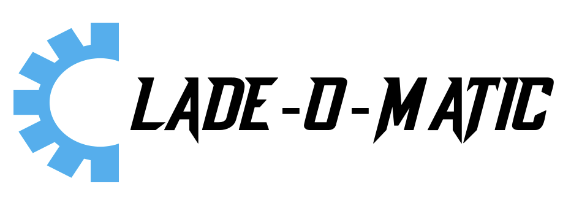

|logo|

|conda| |nbsp| |pypi| |nbsp|  |rtd| |nbsp| |license|


======  ===========
Master  |ci-master|
Dev     |ci-dev|
======  ===========

<p align="left"></p>

## Contents

- [Introduction](#introduction)
- [Installation](#installation)
- [Usage](#usage)
- [Quick Start](#quick-start)
- [FAQ](#faq)
- [Citation](#citation)
- [Legal](#legal)
- [Contact](#contact)

## Introduction

**ALPHA version**

## Installation

Python dependencies (defined in the [requirements](https://github.com/phac-nml/cladeomatic/blob/main/cladeomatic/requirements.txt) file, should be automatically installed when using conda or pip)

In addition to the python dependencies, Clade-o-Matic requires [Jellyfish 2.3.0](https://github.com/gmarcais/Jellyfish/)

Install the latest released version from conda:

        conda create -c bioconda -c conda-forge -n cladeomatic cladeomatic

Install using pip:

        pip install cladeomatic

Install the latest master branch version directly from Github:

        conda install jellyfish
        pip install git+https://github.com/phac-nml/cladeomatic.git


## Usage
If you run ``cladeomatic``, you should see the following usage statement:

    Usage: cladeomatic <command> [options] <required arguments>

    To get minimal usage for a command use:
    cladeomatic command

    To get full help for a command use one of:
    cladeomatic command -h
    cladeomatic command --help


    Available commands:

    create  Define lineages and create a kmer scheme
    benchmark  Benchmark a kmer scheme
    test     Test parsityper functionality on a small dataset [ not implemented]
    version  Print version and exit

Quick start
=====
**Create scheme:**

Option 1 - De novo tree-based <br />
This mode will discover clades and lineages which meet membership size and SNP requirements. 
Input requirements are: 
* newick formatted tree
* VCF
* Reference sequence (.fasta / .gbk)
* Name of outgroup sequence
* Metadata file<br />
  

    cladeomatic create --in_nwk tree.nwk  --in_var variants.vcf --in_meta metadata.txt --outdir scheme/ --root_name ref --reference ref.gbk

Option 2 - Predifined groups <br />
This mode will attempt to define a scheme based on a group manifest which meet membership size and SNP requirements. 
Input requirements are: 
* TSV formatted group file (sample_id, genotype)
* VCF
* Reference sequence (.fasta / .gbk)
* Name of outgroup sequence
* Metadata file<br />
  

    cladeomatic create --in_groups groups.tsv --in_var variants.vcf --in_meta metadata.txt --outdir scheme/ --root_name ref --reference ref.gbk
  

**Outputs:**

```
OutputFolderName
├── {prefix}-clade.snp.histo.html [Tree Mode Only]
├── {prefix}-clades.info.txt
├── {prefix}-filt.kmers.txt
├── {prefix}-genotypes.raw.txt
├── {prefix}-genotypes.supported.txt
├── {prefix}-genotypes.selected.txt
├── {prefix}-genotype.consenus.fasta
├── {prefix}-jellyfish.counts.txt
├── {prefix}-scheme.txt
├── {prefix}-snps.all.txt
├── pseudo.seqs.fasta
├── samples.dists.matrix.csv [Tree Mode Only]
└──
```

**Benchmark Scheme:**
Benchmark the scheme using the original input VCF file and the set of genomes used to construct the scheme.
Input requirements are: 
* VCF
* Clade-O-Matic Scheme
* Metadata file (sample_id,genotype) * Produced by "create" {prefix}-genotypes.selected.txt
  

    cladeomatic benchmark --in_var variants.vcf --in_scheme cladeomatic-scheme.txt --in_meta metadata.txt --outdir benchmark/ 

Evaluate the results for any conflicting genotypes


**Outputs:**

```
OutputFolderName
├── {prefix}-scheme.scores.txt
└── {prefix}-scheme.calls.txt
```

## FAQ

## Citation

## Legal

Copyright Government of Canada 2022

Written by: National Microbiology Laboratory, Public Health Agency of Canada

Licensed under the Apache License, Version 2.0 (the "License"); you may not use
this work except in compliance with the License. You may obtain a copy of the
License at:

http://www.apache.org/licenses/LICENSE-2.0

Unless required by applicable law or agreed to in writing, software distributed
under the License is distributed on an "AS IS" BASIS, WITHOUT WARRANTIES OR
CONDITIONS OF ANY KIND, either express or implied. See the License for the
specific language governing permissions and limitations under the License.


## Contact

**James Robertson**: james.robertson@phac-aspc.gc.ca
